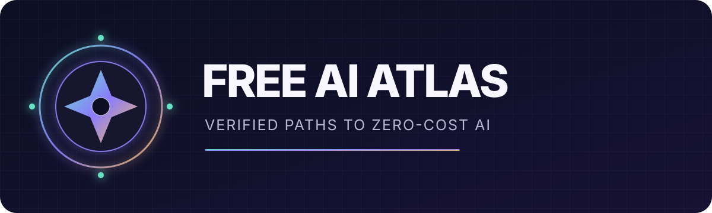

<p align="center">
  
</p>

<p align="center">
  <strong>Trouver, apprendre, construire et exécuter l’IA gratuitement — avec des preuves.</strong>
</p>

<p align="center">
  <a href="README.md">English</a> ·
  <a href="https://arthurecodage.github.io/free-ai-atlas/">Explorer l’atlas en ligne</a> ·
  <a href="CATALOG.fr.md">Catalogue complet</a> ·
  <a href="guides/start-here/README.fr.md">Commencer ici</a> ·
  <a href="CONTRIBUTING.md">Contribuer</a>
</p>

<p align="center">
  
  
  
  
  
</p>

---

Free AI Atlas n’est pas une liste géante de liens. C’est un catalogue structuré et vérifiable de ressources IA utilisables sans payer, accompagné de parcours pratiques pour les débutants et les développeurs.

Chaque fiche explique ce que « gratuit » signifie réellement, les limites, la confidentialité, les comptes ou cartes requis, l’usage commercial, la preuve officielle et la date de vérification.

> [!IMPORTANT]
> Les offres gratuites changent rapidement. Un lien fonctionnel ne prouve pas qu’une offre est encore gratuite. Consulte la source officielle et la date `last_verified` avant d’en dépendre.

## Choisis ton parcours

| Je veux… | Point de départ |
|---|---|
| Essayer l’IA sans rien installer | [Stack de départ à 0 $](stacks/zero-cost-starter.fr.md) |
| Exécuter un assistant privé sur mon ordinateur | [Stack IA locale privée](stacks/local-private-ai.fr.md) |
| Installer l’IA locale sous Windows, macOS ou Linux | [Guides IA locale](guides/local-ai/) |
| Développer avec des API gratuites | [Stack API gratuites](guides/advanced/free-api-stack.md) |
| Générer des images localement | [Stack génération d’images](stacks/image-generation.md) |
| Discuter avec des documents privés | [Stack RAG et documents](stacks/rag-and-documents.md) |
| Apprendre depuis le début | [Parcours d’apprentissage](guides/start-here/README.fr.md) |
| Comparer les outils côte à côte | [Ouvre l’atlas en ligne](https://arthurecodage.github.io/free-ai-atlas/) |
| Exploiter les données du catalogue | Utilise les exports [JSON/CSV](DATA.md) |
| Inspecter la couverture | Ouvre le [tableau de santé du catalogue](STATS.md) |

## Signification des statuts

- **Open source :** le logiciel est disponible sous une licence source; les modèles et le matériel ont leurs propres contraintes.
- **Offre gratuite :** un service hébergé à 0 $ avec des limites définies par le fournisseur.
- **Freemium :** une version gratuite utile existe, mais plusieurs capacités sont payantes.
- **Calcul gratuit :** accès sans frais à du CPU, GPU ou TPU dont la disponibilité est limitée ou dynamique.

## Catalogue vérifié

| Ressource | Catégorie | Gratuité | Accès | Niveau | Vérifié |
|---|---|---|---|---|---|
| [AutoGen](https://github.com/microsoft/autogen) | agents | Open source | local | advanced | 2026-08-04 |
| [CrewAI](https://github.com/joaomdmoura/crewAI) | agents | Open source | local | intermediate | 2026-08-04 |
| [LangChain](https://github.com/langchain-ai/langchain) | agents | Open source | hybrid | intermediate | 2026-08-04 |
| [LangGraph](https://github.com/langchain-ai/langgraph) | agents | Open source | local | intermediate | 2026-08-04 |
| [Gemini Developer API](https://ai.google.dev/) | api | Offre gratuite | cloud | intermediate | 2026-08-04 |
| [GitHub Models](https://github.com/marketplace/models) | api | Offre gratuite | cloud | intermediate | 2026-08-04 |
| [Groq API Free Plan](https://console.groq.com/) | api | Offre gratuite | cloud | intermediate | 2026-08-04 |
| [OpenRouter Free Models](https://openrouter.ai/models?pricing=free) | api | Offre gratuite | cloud | intermediate | 2026-08-04 |
| [Gradio](https://github.com/gradio-app/gradio) | app-builder | Open source | local | beginner | 2026-08-04 |
| [Langflow](https://github.com/langflow-ai/langflow) | app-builder | Open source | local | beginner | 2026-08-04 |
| [Streamlit](https://github.com/streamlit/streamlit) | app-builder | Open source | local | beginner | 2026-08-04 |
| [AnythingLLM](https://github.com/Mintplex-Labs/anything-llm) | assistant | Open source | local | beginner | 2026-08-04 |
| [ChatGPT](https://chatgpt.com/) | assistant | Freemium | cloud | beginner | 2026-08-04 |
| [Claude](https://claude.ai/) | assistant | Freemium | cloud | beginner | 2026-08-04 |
| [Gemini](https://gemini.google.com/) | assistant | Freemium | cloud | beginner | 2026-08-04 |
| [Open WebUI](https://github.com/open-webui/open-webui) | assistant | Open source | local | beginner | 2026-08-04 |
| [Perplexity](https://www.perplexity.ai/) | assistant | Freemium | cloud | beginner | 2026-08-04 |
| [Aider](https://github.com/paul-gauthier/aider) | coding | Open source | local | intermediate | 2026-08-04 |
| [Cline](https://github.com/cline/cline) | coding | Open source | local | intermediate | 2026-08-04 |
| [Continue](https://github.com/continuedev/continue) | coding | Open source | local | beginner | 2026-08-04 |
| [OpenHands](https://github.com/All-Hands-AI/OpenHands) | coding | Open source | local | advanced | 2026-08-04 |
| [Google Colab](https://colab.research.google.com/) | compute | Calcul gratuit | cloud | beginner | 2026-08-04 |
| [Kaggle Notebooks](https://www.kaggle.com/code) | compute | Calcul gratuit | cloud | beginner | 2026-08-04 |
| [Hugging Face Datasets](https://github.com/huggingface/datasets) | dataset | Open source | local | intermediate | 2026-08-04 |
| [DeepEval](https://github.com/confident-ai/deepeval) | evaluation | Open source | local | intermediate | 2026-08-04 |
| [Promptfoo](https://github.com/promptfoo/promptfoo) | evaluation | Open source | local | intermediate | 2026-08-04 |
| [Ragas](https://github.com/explodinggradients/ragas) | evaluation | Open source | local | intermediate | 2026-08-04 |
| [ComfyUI](https://github.com/comfyanonymous/ComfyUI) | image-generation | Open source | local | intermediate | 2026-08-04 |
| [Diffusers](https://github.com/huggingface/diffusers) | image-generation | Open source | local | intermediate | 2026-08-04 |
| [InvokeAI](https://github.com/invoke-ai/InvokeAI) | image-generation | Open source | local | intermediate | 2026-08-04 |
| [Stable Diffusion WebUI Forge](https://github.com/lllyasviel/stable-diffusion-webui-forge) | image-generation | Open source | local | intermediate | 2026-08-04 |
| [ONNX Runtime](https://github.com/microsoft/onnxruntime) | inference-server | Open source | local | intermediate | 2026-08-04 |
| [vLLM](https://github.com/vllm-project/vllm) | inference-server | Open source | local | advanced | 2026-08-04 |
| [Hugging Face Agents Course](https://github.com/huggingface/agents-course) | learning | Open source | cloud | intermediate | 2026-08-04 |
| [Hugging Face LLM Course](https://huggingface.co/learn/llm-course/chapter1/1) | learning | Offre gratuite | cloud | intermediate | 2026-08-04 |
| [Microsoft AI for Beginners](https://github.com/microsoft/AI-For-Beginners) | learning | Open source | cloud | beginner | 2026-08-04 |
| [Microsoft Generative AI for Beginners](https://github.com/microsoft/generative-ai-for-beginners) | learning | Open source | cloud | beginner | 2026-08-04 |
| [Practical Deep Learning for Coders](https://course.fast.ai/) | learning | Offre gratuite | cloud | intermediate | 2026-08-04 |
| [GPT4All](https://github.com/nomic-ai/gpt4all) | local-runtime | Open source | local | beginner | 2026-08-04 |
| [llama.cpp](https://github.com/ggml-org/llama.cpp) | local-runtime | Open source | local | advanced | 2026-08-04 |
| [LocalAI](https://github.com/mudler/LocalAI) | local-runtime | Open source | local | intermediate | 2026-08-04 |
| [Ollama](https://github.com/ollama/ollama) | local-runtime | Open source | local | beginner | 2026-08-04 |
| [BentoML](https://github.com/bentoml/BentoML) | ml-framework | Open source | local | intermediate | 2026-08-04 |
| [JAX](https://github.com/jax-ml/jax) | ml-framework | Open source | local | advanced | 2026-08-04 |
| [MLflow](https://github.com/mlflow/mlflow) | ml-framework | Open source | local | intermediate | 2026-08-04 |
| [TensorFlow](https://github.com/tensorflow/tensorflow) | ml-framework | Open source | local | intermediate | 2026-08-04 |
| [Transformers](https://github.com/huggingface/transformers) | ml-framework | Open source | local | intermediate | 2026-08-04 |
| [Hugging Face Model Hub](https://huggingface.co/models) | model-hub | Freemium | hybrid | intermediate | 2026-08-04 |
| [DSPy](https://github.com/stanfordnlp/dspy) | rag | Open source | local | advanced | 2026-08-04 |
| [LlamaIndex](https://github.com/run-llama/llama_index) | rag | Open source | local | intermediate | 2026-08-04 |
| [Edge TTS](https://github.com/rany2/edge-tts) | speech | Offre gratuite | cloud | beginner | 2026-08-04 |
| [Faster Whisper](https://github.com/SYSTRAN/faster-whisper) | speech | Open source | local | intermediate | 2026-08-04 |
| [OpenAI Whisper](https://github.com/openai/whisper) | speech | Open source | local | intermediate | 2026-08-04 |
| [Pyannote Audio](https://github.com/pyannote/pyannote-audio) | speech | Open source | local | intermediate | 2026-08-04 |
| [whisper.cpp](https://github.com/ggerganov/whisper.cpp) | speech | Open source | local | intermediate | 2026-08-04 |
| [Chroma](https://github.com/chroma-core/chroma) | vector-database | Open source | local | intermediate | 2026-08-04 |
| [Faiss](https://github.com/facebookresearch/faiss) | vector-database | Open source | local | advanced | 2026-08-04 |
| [Milvus](https://github.com/milvus-io/milvus) | vector-database | Open source | local | advanced | 2026-08-04 |
| [Qdrant](https://github.com/qdrant/qdrant) | vector-database | Open source | local | intermediate | 2026-08-04 |
| [Weaviate](https://github.com/weaviate/weaviate) | vector-database | Open source | local | intermediate | 2026-08-04 |

## Modèle de confiance

Free AI Atlas sépare trois vérifications :

1. la validation du schéma détecte les fiches manquantes ou contradictoires;
2. l’audit quotidien détecte les liens officiels morts ou bloqués;
3. une revue des preuves confirme les prix, limites, licences et règles de confidentialité avant de modifier `last_verified`.

Les automatisations peuvent ouvrir des issues ou des pull requests avec leurs preuves. Elles ne modifient pas silencieusement les informations importantes. Consulte [VERIFICATION.md](VERIFICATION.md).

## Lancer le projet localement

```bash
python scripts/validate.py
python scripts/build.py --check
python -m unittest discover -s tests -v
python -m http.server 8000
```

Ouvre ensuite <http://localhost:8000/site/>.

## Contribuer

Une nouvelle ressource ou une limite modifiée? Utilise le formulaire d’issue correspondant. Pour une pull request, modifie un fichier dans `data/resources/`, exécute les vérifications et joins une source officielle.

Consulte [CONTRIBUTING.md](CONTRIBUTING.md), [GOVERNANCE.md](GOVERNANCE.md) et le [Code de conduite](CODE_OF_CONDUCT.md).

Consulte aussi la [feuille de route](ROADMAP.md), le guide des [données structurées](DATA.md) et la [santé du catalogue](STATS.md) pour voir les priorités et les besoins.

## Périmètre

Une ressource doit fournir une valeur durable et significative sans paiement. Les essais courts, le piratage, les clés divulguées, le contournement de quotas et les méthodes qui violent les licences sont exclus.

Free AI Atlas ne garantit ni la disponibilité ni la légalité d’un usage particulier. Vérifie toujours les conditions actuelles du fournisseur avant un usage commercial ou sensible.
